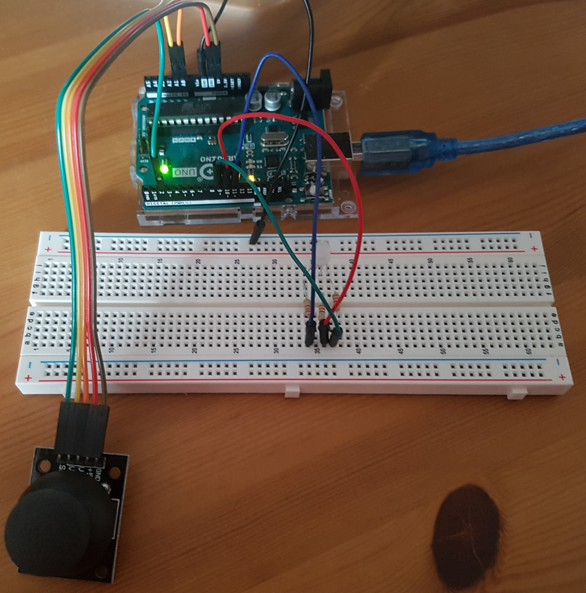

# Joystick Colour Wheel

Controls an RGB LED with a joystick. 

As the joystick rotates around, the LED changes colour. The distance of the joystick from the centre determines the brightness of the light.

## Schematic

## Images

